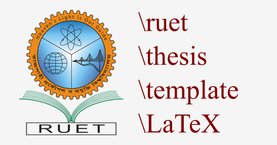

# RUET Thesis Template LaTeX

A boilerplate LaTeX template for writing B.Sc. Undergraduate Thesis under at RUET.

## Features

* Uses latex `subfiles` module to load title page, acknowledgement page, certificate page, abstract page, chapters, and appendix from separate `tex` files
* IEEE styled bibliography from separate `bib` file

## Examples

* Demo chapters, sections, and subsections
* Demo single figures, multiple figures and captions
* Demo list items
* Demo enumerated items
* Demo tables
* Demo equations

## System Requirment

Install TeXstudio to compile and view the LaTex project.

* Linux: `apt-get install -y lyx texstudio texlive-extra-utils`
* OS X: `brew cask install texstudio`
* Windows: Download from `http://sourceforge.net/projects/texstudio/files/texstudio/`

## Preview

Download `document.pdf` and open with any PDF viewer or [click here](PREVIEW.md) to see the page previews.
